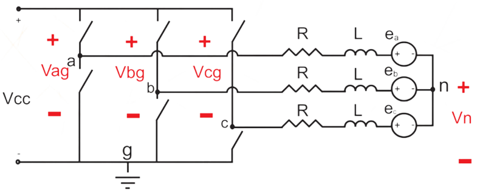

# Python-Simulation-of-BLDC-motor

Simulation of a BLDC motor using python.
Two methodos implemented, V/F scalar control, in open-loop, and IFOC closed-loop control.

## Mathematical model for the BLDC motor

$$
\frac{d}{dt}
\left(\begin{array}{c}
I_a\\
I_b \\
I_c \\
\omega_r \\
\theta_e
\end{array}\right)
= \left(\begin{array}{ccccc}
-\frac{R}{L-M} & 0 & 0 & -\frac{P_p\phi_mF_a(\theta_e)}{L-M} & 0\\
0 & -\frac{R}{L-M} & 0 & -\frac{P_p\phi_mF_b(\theta_e)}{L-M} & 0\\
0 & 0 & -\frac{R}{L-M} & -\frac{P_p\phi_mF_c(\theta_e)}{L-M} & 0\\
0 & 0 & -\frac{R}{L-M} & -\frac{P_p\phi_mF_c(\theta_e)}{L-M} & 0\\
\frac{P_p\phi_mF_A(\theta_e)}{J} & \frac{P_p\phi_mF_B(\theta_e)}{J} & \frac{P_p\phi_mF_C(\theta_e)}{J} & -\frac{B}{J} & 0 \\
0 & 0 & 0 & P_p & 0
\end{array}\right)
\left(\begin{array}{c}
I_a \\
I_b \\
I_c \\
\omega_r \\
\theta_e
\end{array}\right)
+
\left(\begin{array}{cccc}
\frac{1}{L-M} & 0 & 0 & 0\\
0 & \frac{1}{L-M} & 0 & 0\\
0 & 0 & \frac{1}{L-M} & 0\\
0 & 0 & 0 & -\frac{1}{J} \\
0 & 0 & 0 & 0
\end{array}\right)
\left(\begin{array}{c}
V_{an} \\
V_{bn} \\
V_{cn} \\
T_c
\end{array}\right)
$$

## Mechanical equation from the model
$$
J\frac{d\omega_m}{dt} = T_e -T_l -B_v\omega_m
$$

where:
$$
T_e = P_p\phi_m[i_af_A(\theta_e)+i_bf_B(\theta_e)+i_cf_C(\theta_e)]
$$

## Inverter equation

$
V_{an},
V_{bn},
V_{cn}:
$ 
states that the Tensions are $V_a - V_n$ where $V_n$ is the potential on the wire junction of the rotor, as seen in the figure bellow:

To do this transformation a matrix was calculated:

$$
\left(\begin{array}{c}
V_{an} \\
V_{bn} \\
V_{cn}
\end{array}\right)
=
\left(\begin{array}{ccc}
\frac{2}{3} & -\frac{1}{3} & -\frac{1}{3} \\
-\frac{1}{3} & \frac{2}{3} & -\frac{1}{3} \\
-\frac{1}{3} & -\frac{1}{3} & \frac{2}{3}
\end{array}\right)
\left(\begin{array}{c}
V_{ag} \\
V_{bg} \\
V_{cg}
\end{array}\right)
+
\frac{1}{3}
\left(\begin{array}{ccc}
1 & 1 & 1 \\
1 & 1 & 1 \\
1 & 1 & 1
\end{array}\right)
\left(\begin{array}{c}
e_a \\
e_b \\
e_c
\end{array}\right)
$$

## FOC mathematical operations

### Clarke transform

$$
    \left(\begin{array}{c}
    V_0 \\
    V_\alpha \\
    V_\beta
    \end{array}\right)
    =
    \sqrt{\frac{2}{3}}
    \left(\begin{array}{ccc}
    \sqrt{\frac{1}{2}} & \sqrt{\frac{1}{2}} & \sqrt{\frac{1}{2}} \\
    1 & -\frac{1}{2} & -\frac{1}{2} \\
    0  & \frac{\sqrt{3}}{2} & -\frac{\sqrt{3}}{2}
    \end{array}\right)
    \left(\begin{array}{c}
    V_A \\
    V_B \\
    V_C
    \end{array}\right)
$$

### Clarke Inverse Transform

$$
    \left(\begin{array}{c}
    V_A \\
    V_B \\
    V_C
    \end{array}\right)
    =
    \left(\begin{array}{ccc}
    \frac{\sqrt{2}}{2} & 1 & 0\\
    \frac{\sqrt{2}}{2} & -\frac{1}{2} & \frac{\sqrt{3}}{2} \\
    \frac{\sqrt{2}}{2} & -\frac{1}{2} & -\frac{\sqrt{3}}{2}
    \end{array}\right)
    \left(\begin{array}{c}
    V_0 \\
    V_\alpha \\
    V_\beta
    \end{array}\right)
$$

### Park Transform

$$
    \left(\begin{array}{c}
    V_d \\
    V_q
    \end{array}\right)
    =
    \left(\begin{array}{cc}
    \cos(\theta) & \sin(\theta) \\
    -\sin(\theta) & \cos(\theta)
    \end{array}\right)
    \left(\begin{array}{c}
    V_\alpha \\
    V_\beta
    \end{array}\right)
$$

### Inverse Park Transform

$$
    \left(\begin{array}{c}
    V_\alpha \\
    V_\beta
    \end{array}\right)
    =
    \left(\begin{array}{cc}
    \cos(\theta) & -\sin(\theta) \\
    \sin(\theta) & \cos(\theta)
    \end{array}\right)
    \left(\begin{array}{c}
    V_d \\
    V_q
    \end{array}\right)
$$

### Motor specs

For this work i will be using a A2212/13T brushless motor.

* Resistance 0.090$\Omega$
* Poles 14
* Inductance 0.1mH

## Calculations
$
K_v = \frac{\omega_{rpm}}{V_P0.95}
$

$K_v$ - is the voltage constante of a motor, rought means how many rotations the motor will go for every Volt.

$
K_p = \frac{60}{2 \pi  K_v}
$
if Kv in rpm

for Kv in rad it simply is the inverse of Kp

$
K_p = \frac{1}{K_v}
$
